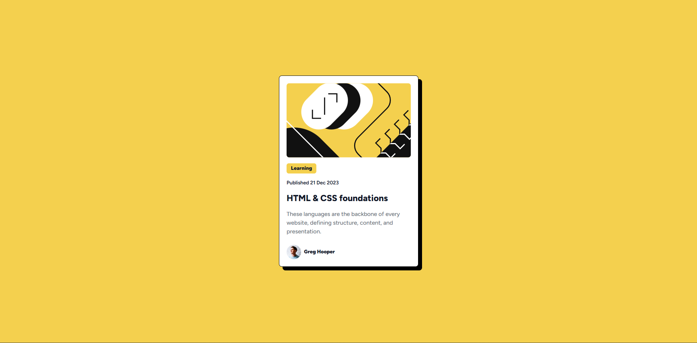

# Frontend Mentor - Blog preview card solution

This is a solution to the [Blog preview card challenge on Frontend Mentor](https://www.frontendmentor.io/challenges/blog-preview-card-ckPaj01IcS). Frontend Mentor challenges help you improve your coding skills by building realistic projects. 

## Table of contents

- [Overview](#overview)
  - [Screenshot](#screenshot)
  - [Links](#links)
- [My process](#my-process)
  - [Built with](#built-with)
  - [What I learned](#what-i-learned)
- [Author](#author)
- [Acknowledgments](#acknowledgments)

**Note: Delete this note and update the table of contents based on what sections you keep.**

## Overview

### Screenshot

### Links

- Live Site URL: [Vercel](https://blog-preview-kappa-one.vercel.app/)

## My process

### Built with

- Semantic HTML5 markup
- Flexbox
- Mobile-first workflow
- [Tailwind](https://tailwindcss.com/) - CSS Framework

**Note: These are just examples. Delete this note and replace the list above with your own choices**

### What I learned

To be honnest, im not learn anything new but just practice my tailwind skills.

## Author

- Frontend Mentor - [@yourusername](https://www.frontendmentor.io/profile/St4rkXc)
- Instagram - [@dhios.ntz](https://www.instagram.com/dhios.ntz/)

## Acknowledgments

just do it

